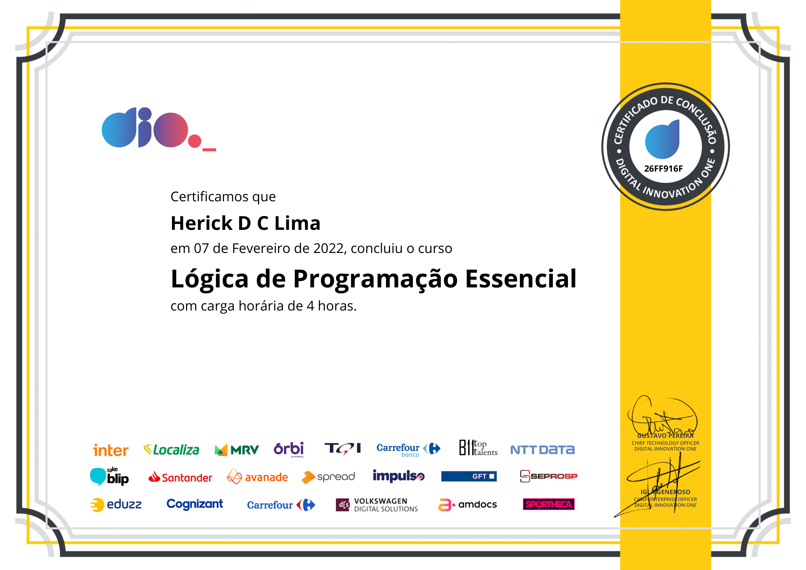

# DIO-Bootcamp-Java
Este repositório é para organizar os conteúdos do bootcamp de Java da DIO.

## Neste readme irei exibir meus certificados obtidos no bootcamp

- ### **Boas vindas**

 

- ### **Lógica de programação**

 

- ### **Estruturas de dados e algorítmos**

 

- ### **Git**
